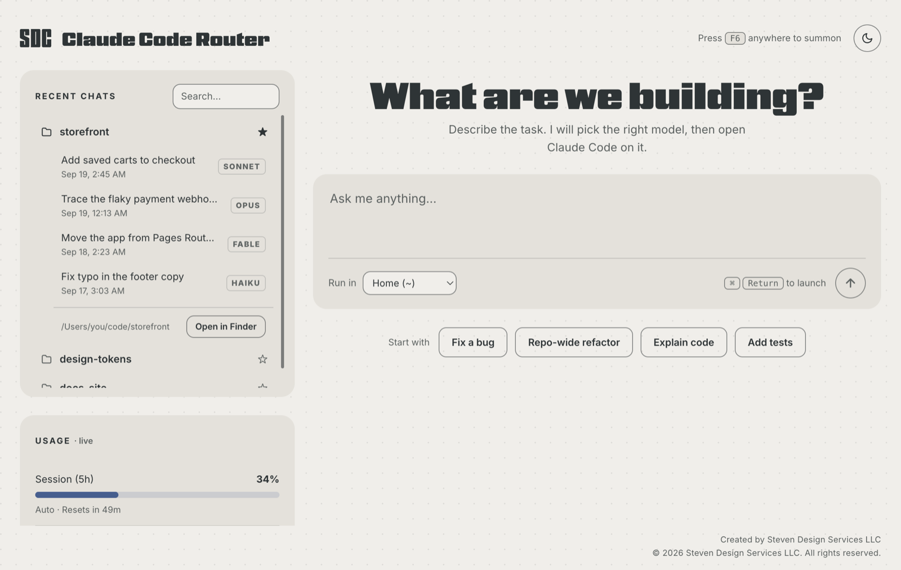
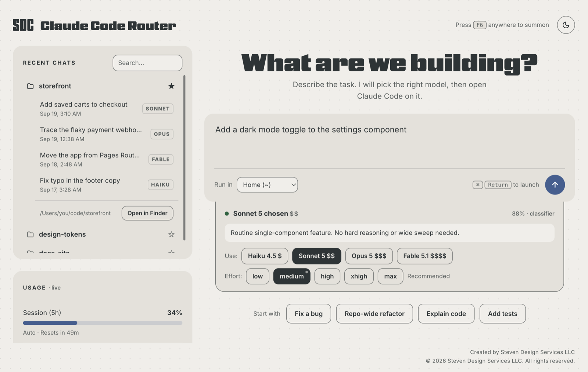
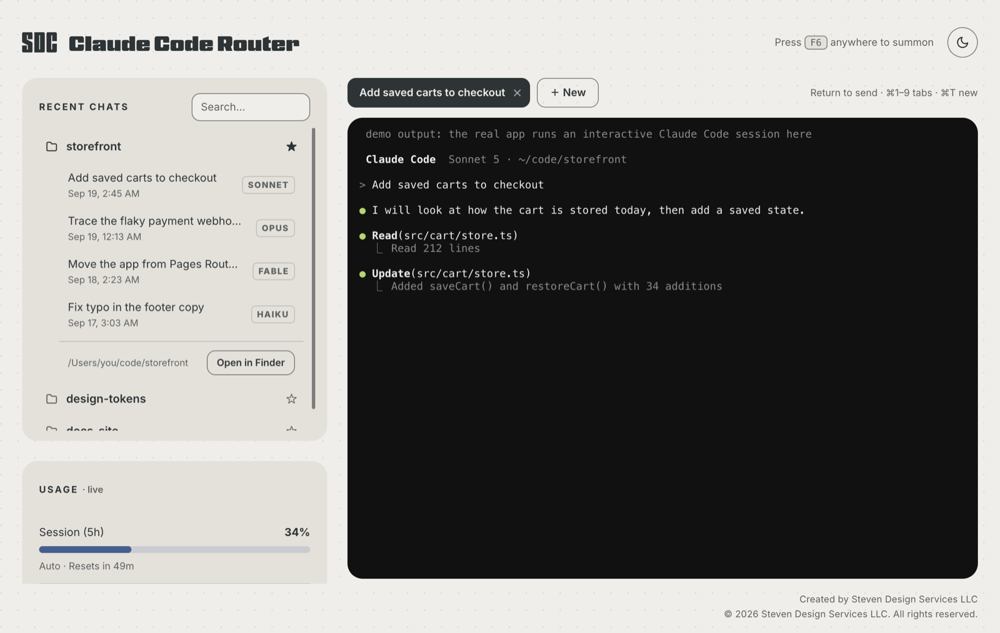
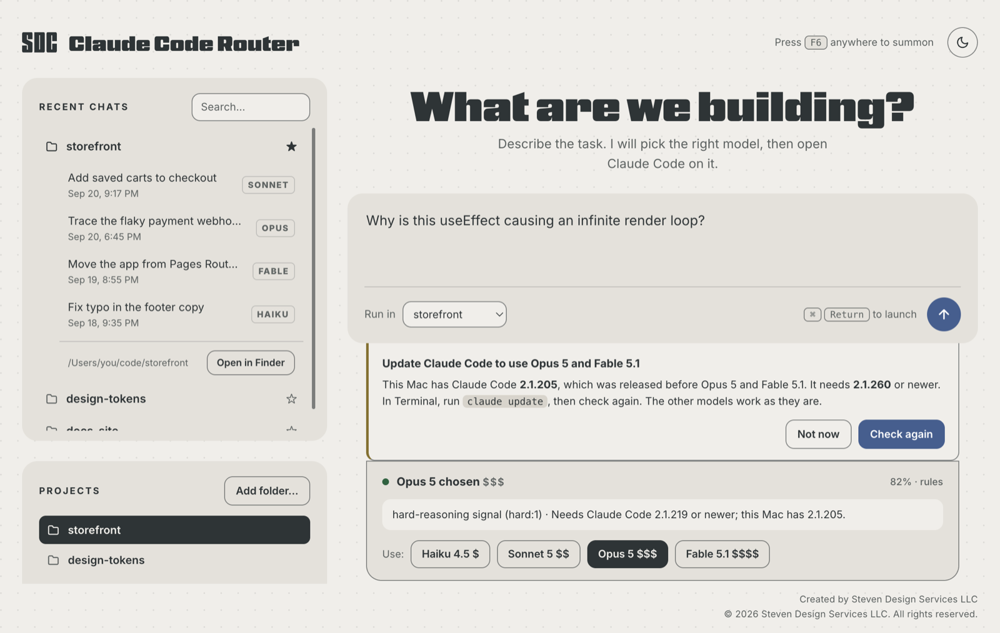
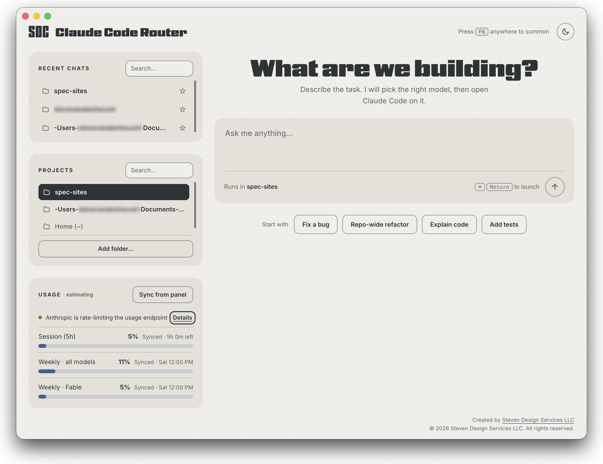
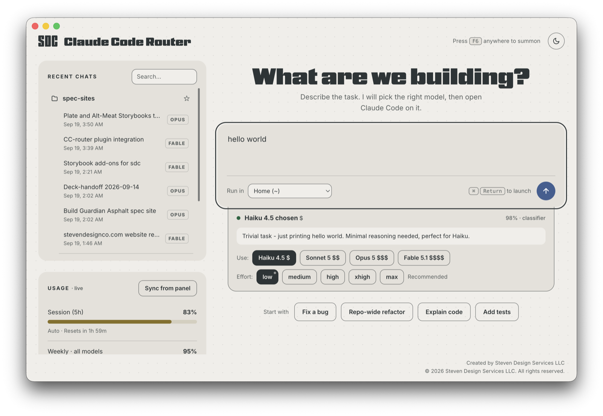
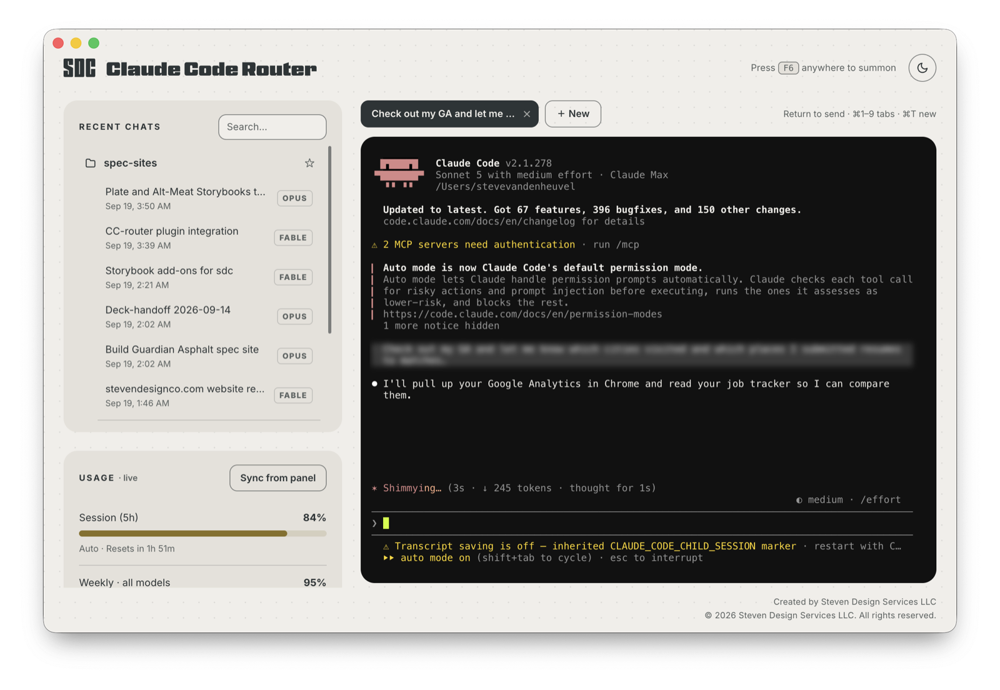
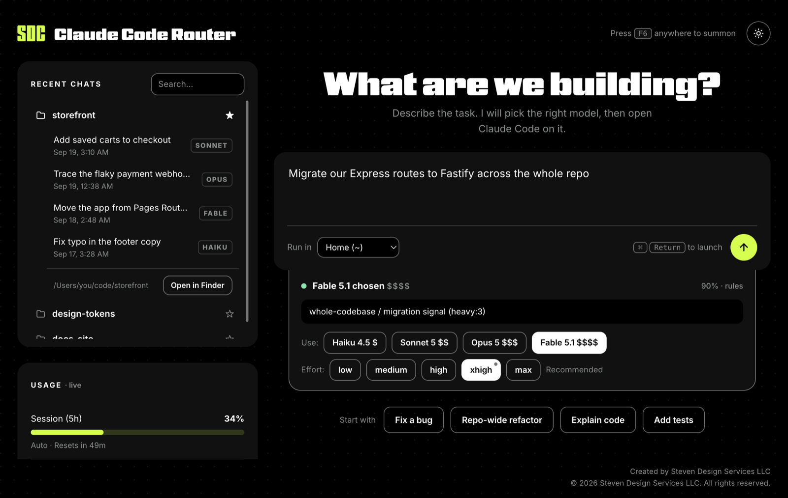
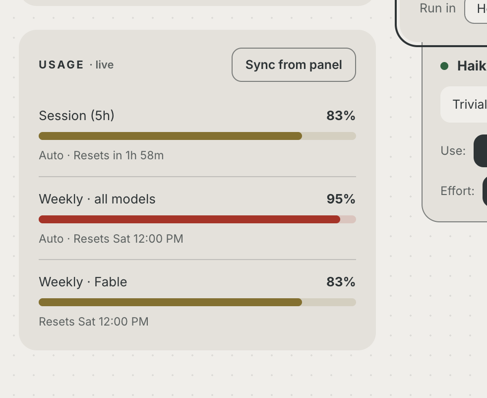

# SDC Claude Code Router

**SDC Claude Code Router** sends each prompt to the right Claude model, so the
expensive models are saved for the work that needs them. It comes in two parts that share one
routing engine:

- **A macOS desktop app.** You type a prompt, it picks a model, asks you when it is
  unsure, then opens a real, interactive Claude Code session in an embedded terminal.
  It tracks your plan usage live and recalls past sessions by project.
- **A Claude Code plugin.** The same routing rules inside Claude Code itself,
  including the VS Code and Cursor extension. It tells you when a prompt is over or
  under powered for the model you are on, and adds commands that run one prompt on a
  chosen tier.

> Copyright © 2026 Steven Design Services LLC. Licensed under the
> [Apache License 2.0](LICENSE). The cc-router and Steven Design Co. names and marks
> are not covered by that license.

## The models

| Tier | Model       | ID                 | Use for                                                      |
|------|-------------|--------------------|--------------------------------------------------------------|
| 1    | Haiku 4.5   | `claude-haiku-4-5` | small edits, questions, quick lookups, formatting            |
| 2    | Sonnet 5    | `claude-sonnet-5`  | everyday coding: features, bug fixes, reviews, routine multi-file work |
| 3    | Opus 5      | `claude-opus-5`    | hard reasoning, architecture, tricky debugging, big multi-file changes |
| 4    | Fable 5.1   | `claude-fable-5-1` | repo-wide migrations, long autonomous runs                   |

The whole catalog lives in one file, [src/models.js](src/models.js): IDs, labels,
prices, and the oldest Claude Code version each model needs. The app, the plugin, the
classifier prompt, and the usage meter all read from it, so moving to a new model
generation is a one-file change.

## The desktop app

- **Smart model routing.** Local rules settle the obvious cases instantly and for
  free (a repo-wide migration goes to Fable, a typo goes to Haiku). A small Haiku
  classifier handles the ambiguous ones. The decision slides out from under the
  input box in a status card that says in words whether the router chose or whether
  it is your call. One tap overrides it, and the app can **learn a default model per
  project** from your overrides.
- **Effort, recommended and adjustable.** The card also suggests how hard Claude
  should think (`low`, `medium`, `high`, `xhigh`, `max`) and passes it to Claude
  Code as `--effort`. A small task gets `low`, hard reasoning gets `high`, and a
  whole-repo job gets `xhigh`; `max` is never suggested, only chosen. Pick any level
  by hand, and a link takes you back to the recommendation. The row only appears
  when your Claude Code supports `--effort`, so an older CLI is never sent a flag it
  would refuse.
- **Embedded Claude Code.** Real, interactive `claude` sessions inside the app
  (node-pty and xterm), with **tabs** for concurrent sessions, **desktop
  notifications** when a background session finishes or waits on you, and keyboard
  shortcuts (⌘T new, ⌘1–9 switch, ⌘Enter launch). Sessions start clean even when
  the app itself was opened from inside another Claude Code session: the parent's
  session markers are stripped (see `src/env.js`), so every chat saves its transcript
  and shows up in recall.
- **Live usage meter, fully automatic.** Reads your real plan usage from Anthropic
  with the Claude Code login already in your Keychain: the 5-hour session, the week,
  and the weekly Fable limit, each with its true reset time, plus how the week splits
  across Claude Code, Chats, and Cowork. It refreshes every minute and whenever you
  come back to the window, and it spends no tokens. There is nothing to sync by hand.
- **Session recall.** A folder browser over your Claude Code history with Claude's
  own titles, a model badge per chat, search, pinned projects, resume any session,
  and Open in Finder. A chat resumes in its own model family, so an old Opus chat
  reopens on the current Opus.
- **A version check before launch.** Sessions run the `claude` on your PATH, and that
  binary only updates itself when it runs. If it is older than a model needs, the app
  says so and tells you to run `claude update` instead of launching a model the CLI
  has never heard of. The recommendation slides out from under the input box, and
  only when it applies. The app reads your PATH from an interactive shell at startup,
  so it finds `claude` when opened from the Dock as well as from Terminal.
- **A summon key.** Press F6 anywhere to bring the window forward. A global shortcut
  takes its key from every other app, so F6 was chosen for what it costs elsewhere:
  macOS leaves it alone and in Cursor it is only "focus next pane". To change it, set
  `"hotkey"` in `~/.cc-router/ui.json`. On a Mac keyboard, hold fn unless the function
  keys are set as standard keys.
- **Prompt starters.** The four buttons under the input write the opening words of a
  prompt into the box and leave the cursor at the end. Nothing launches.









The screenshots above use demo data. The two below are the app in real use, with a
live usage meter and real chat history.







## The plugin

Nothing a plugin ships can change the model of a running session. There is no hook
output for it. So the plugin does the three things that are possible:

- **A nudge when the tier is wrong.** A prompt hook runs the same local rules as the
  desktop app. No classifier call, no network, no tokens, about 40 milliseconds. If
  you are on Fable and ask for a typo fix, you get one line saying so. It stays quiet
  when the rules are unsure, when the tier already fits, and after three nudges in
  one direction per session.
- **One-turn tier commands.** A skill can pin a model for its own turn, after which
  the session returns to its model.

  | Command             | Runs the prompt on |
  |---------------------|--------------------|
  | `/cc-router:quick`  | Haiku              |
  | `/cc-router:build`  | Sonnet             |
  | `/cc-router:deep`   | Opus               |
  | `/cc-router:max`    | Fable              |
  | `/cc-router:route`  | Haiku. Sizes the task and names the command to use, without starting the work |

- **Model-pinned subagents.** `quick-worker` (Haiku), `build-worker` (Sonnet), and
  `deep-worker` (Opus), so a session on an expensive model can hand routine subtasks
  down, and a session on a cheap one can hand the hard part up.

Install it from this repository:

```
/plugin marketplace add vandy1690/cc-router
/plugin install cc-router@cc-router
```

Or try it from a local checkout without installing:

```bash
claude --plugin-dir /path/to/cc-router
```

The plugin needs Claude Code 2.1.260 or newer. The tier commands use model aliases
(`haiku`, `sonnet`, `opus`, `fable`), so they follow new releases on their own.

## Design

The app wears the [Steven Design Co. design system](https://stevendesignco.com/labs/sdc-storybook/),
the same tokens [stevendesignco.com](https://stevendesignco.com) ships, by name and by
value: warm paper and charcoal ink with a single Regatta blue accent in light mode,
black with lime in dark mode, Nickel Gothic for display and Inter for text, 18px cards
and 10px controls, and the dot grain on the ground. Cards sit flat: on the site the card
shadow belongs to cards that lift, and nothing here lifts. The two drawers under the
input slide out on one curve, with the opening height and the slide timed together,
and people who ask for reduced motion get them without the animation. Light is the
default and the toggle in the header switches themes.

The Dock icon is "CC" in Nickel Gothic, charcoal ink (#2D3436) on the paper ground
(#F0EEE9), centred on the letters themselves. `build/icon.png` is what the Dock shows
when the app runs from source; `build/icon.icns` is the same art at every macOS size
for a packaged build.


The same rules apply as on the site. The focus ring is the page's own ink and shows
only for keyboard focus. Every row, tab, and chip is a real button, so the whole app
works from the keyboard. Status never relies on colour alone: the routing block says
in words whether the router chose, and each meter prints its percentage. The three
status colours are the only additions to the token set, and each was checked for
contrast on both the paper and the card.



## On the name

There is an established project called **claude-code-router**
([musistudio/claude-code-router](https://github.com/musistudio/claude-code-router)),
with roughly 37,000 stars. It is a different tool and it got there first. This one
carries the SDC prefix to keep the two apart, and the repository slug stays
`cc-router`. If you came here looking for that project, the link above is it.

## How it compares, in plain English

Plenty already exists here, and more arrives every month. The honest summary is that
the field splits into tools that **measure** and tools that **route**, and this one is
trying to sit in the gap between them.

**Routing.** [musistudio/claude-code-router](https://github.com/musistudio/claude-code-router)
is the big one: a local control plane that routes coding agents across providers, with
retries, credential pools, fallback, a desktop app and a web UI, plus per-request
observability down to tokens and estimated cost. **OpenRouter**, **Not Diamond** and
**Martian** pick a model per prompt. **LiteLLM**, **Portkey** and the **Vercel AI
Gateway** add routing, fallback and cost tracking across providers. All of them run on
provider API keys.

**Measuring.** [ccusage](https://ccusage.com/) reports historical cost from local
transcripts across many agent CLIs. Claude Code Usage Monitor gives a live terminal
dashboard with burn rate and predictions. ccflare and Blume cover similar ground, Blume
as a desktop app across Claude Code and Codex. None of them route.

**Claude Code itself.** The desktop app now has parallel sessions, per-session history
in a filterable sidebar, a model dropdown you can change mid-session, and a usage ring
showing plan usage for the period. `/effort` and `--effort` are native. Subagent model
pinning is native. Much of what this app does for sessions, Anthropic now does too.

**What is left, and it is the reason this exists.** Claude Code has
[no automatic model selection](https://code.claude.com/docs/en/model-config). You pick,
every time, through `/model`, `--model`, an environment variable or settings. The
routers will pick for you but bill per token on their own API keys. The monitors will
tell you what you spent but never act on it. Anthropic gives you a picker, not a
decision.

So: **read the prompt, choose the tier, launch on the subscription you already pay for,
and show what is left of it.** That combination is the only part of this that is not
already covered by something better resourced, and it is a small target on purpose.

## Requirements

**To run the app**

- **macOS 12 (Monterey) or newer.** The bundled Electron 43 will not start on older
  versions.
- **Node.js 18 or newer** and npm. `package.json` declares this in `engines`.
- **Xcode Command Line Tools** (`xcode-select --install`). `node-pty`, which runs the
  embedded terminals, is a native module and is compiled on install.
- **Claude Code** (the `claude` CLI) installed and logged in. The app finds it in
  `~/.local/bin` or on your shell's PATH, even when opened from the Dock.
- **Claude Code 2.1.260 or newer for the full catalog.** Sonnet 5 needs 2.1.197, Opus 5
  needs 2.1.219, and Fable 5.1 needs 2.1.260. Older versions still work for the models
  they know, and the app says which ones need `claude update`.
- **A Claude Code that lists `--effort` in `claude --help`** for the effort control.
  Tested on 2.1.278. Without it, the effort row is hidden and sessions start at Claude
  Code's default effort.
- **A Claude subscription.** It is built around Max. Sessions and the routing
  classifier run on your plan, not the API.

**Optional**

- **Keychain access** for the live usage meter. macOS asks once; choose Always Allow.
  Without it, the meter falls back to an estimate from your local transcripts.
- **A network connection** for the display face (Nickel Gothic from Adobe Fonts).
  Offline, headings fall back to Inter, which ships with the app.

**For the plugin**

- Claude Code 2.1.260 or newer. The manifest passes `claude plugin validate` on 2.1.277.

## Setup

`node_modules` is not committed. `npm install` also builds `node-pty` for Electron (a
`postinstall` step), so two commands are enough:

```bash
npm install   # installs, then rebuilds node-pty against Electron's ABI
npm start     # launch the app
```

If the terminals ever fail to start after an Electron or Node update, run
`npm run rebuild`.

The engines also run headless, without the UI:

```bash
npm run route -- "migrate our API across the repo"   # route one prompt
npm run route:test                                   # assert the routing and effort rules (free, no network)
npm run projects                                     # recent chats by project
npm run usage                                        # usage meter from local transcripts
```

## How routing works

1. **Local rules** handle the obvious prompts instantly, with no network and no cost.
   Every signal is matched on word boundaries. Matching plain substrings misfires:
   "export to" contains "port to", "improve" contains "prove", and "information"
   contains "format". Anything ambiguous is left to the classifier, because a
   confident wrong answer is the worst thing a router can do.
2. **Ambiguous** prompts go to a quick **Haiku** classifier that returns
   `{ model, confidence, reason }`. The call is stripped of Claude Code's tools, MCP
   servers, skills, settings files, and default system prompt, which cut it from about
   29,500 tokens to about 1,000 in testing, and it never writes a transcript. It still
   takes several seconds, so the app says "Picking a model" at once and lets you launch
   on Sonnet, or pick a model yourself, without waiting. A call you have typed past is
   cancelled.
3. Below `CONFIRM_THRESHOLD` (0.75) the app **asks you** and offers every model as a
   one-tap override.
4. Every decision carries a recommended **effort**. Each model has a starting level in
   `src/models.js` (Haiku `low`, Sonnet `medium`, Opus and Fable `high`), and the rule
   that fired moves it: a small task drops to `low`, hard reasoning or several named
   files goes to `high`, a whole-codebase sweep goes to `xhigh`.

`npm run route:test` asserts all of this, including the prompts that used to misroute
and the recommended effort for each rule.

## How usage tracking works

The meter reads the same usage endpoint Claude Code's own `/usage` screen does. It is a
plain GET, so it costs nothing, and it returns every bucket with its reset time: the
session, the week, the weekly Fable limit, and the week's split by surface. The Claude
Code OAuth token is read from the macOS Keychain, used only in the request header, and
never logged, stored, or refreshed by this app. Claude Code owns the login.



That endpoint is not a documented public API, so there are two fallbacks. First, the
`anthropic-ratelimit-unified-5h-*` and `-7d-*` headers on a one-token request, which
cover the session and the week. Then a weighted estimate from your local transcripts
plus a manual sync from the panel. The Sync button only appears when the live numbers
are incomplete. Each message is counted once (Claude
Code writes one transcript line per content block, and each line repeats the whole
message's token usage). Models the router no longer launches are still priced, so last
week's sessions keep counting after a catalog update. The ceilings in
[src/usage.js](src/usage.js) only matter on that last fallback.

## How chat recall works

Claude Code stores history per project under
`~/.claude/projects/<encoded-cwd>/<session-id>.jsonl`. The app reads that, read-only,
lists past chats with Claude's own `ai-title` and the model used, and reopens any chat
with `claude --resume <id> --model <model>` in the project directory. App state (pins,
preferences, manual sync, theme) lives in `~/.cc-router/`.

## Repository layout

```
main.js, preload.js, renderer/            the desktop app
src/                                      the shared engine: catalog, rules, usage, recall
.claude-plugin/, skills/, agents/, hooks/ the Claude Code plugin
build/                                    the Dock icon (png, icns)
docs/                                     README screenshots
```

## Contributing

Issues, ideas and pull requests are welcome. Contributions are accepted under the
Apache License 2.0, per section 5 of the License, so there is no separate agreement
to sign.

Two things worth knowing before opening a pull request:

- `npm run route:test` asserts the routing and effort rules, costs nothing, and needs
  no network. Add a case to it for any rule you change.
- The model catalog lives in one file, [src/models.js](src/models.js). IDs, labels,
  prices, starting effort, and the minimum Claude Code version per model all read
  from there.

If you fork it and take it somewhere interesting, I would like to hear about it.

## License

Copyright © 2026 Steven Design Services LLC.

Licensed under the Apache License, Version 2.0. See [LICENSE](LICENSE) and
[NOTICE](NOTICE). You may use, modify and redistribute this software, including
commercially, provided you keep the copyright notice and the NOTICE file and state
what you changed.

The License covers the code. Under section 6 it does not grant rights to the
"cc-router" or "Claude Code Router" names, the Steven Design Co. name or mark, or
the design system the app is dressed in. Fork the code freely and ship it under your
own name.

Built by Steven Vanden Heuvel, Steven Design Services LLC.
[stevendesignco.com](https://stevendesignco.com)
